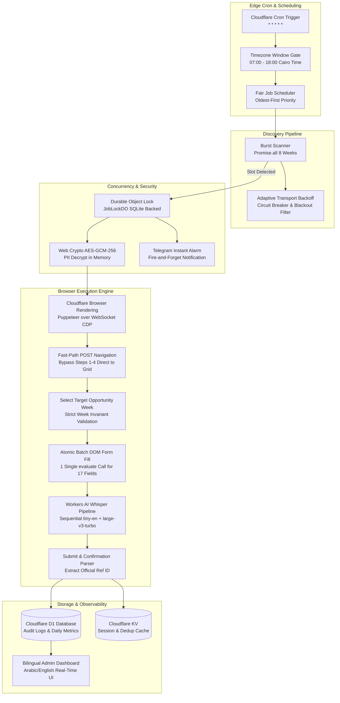

# 🛡️ AegisFlow

> **High-concurrency consular appointment scheduling engine built on Cloudflare Workers edge architecture.**

[](https://www.typescriptlang.org/)
[](https://workers.cloudflare.com/)
[](https://developers.cloudflare.com/d1/)
[](https://developers.cloudflare.com/durable-objects/)
[](https://developers.cloudflare.com/workers-ai/)
[](https://nodejs.org/)
[](https://opensource.org/licenses/MIT)

---

## 📌 Executive Overview

**AegisFlow** is an enterprise-grade, edge-native automation platform designed to solve the ultra-competitive challenge of securing consular visa appointments (specifically for the Austrian Embassy in Cairo via the BMEIA scheduling system).

In peak demand windows, appointment slots are released unexpectedly, claimed in **under 15 seconds**, and protected by dynamic ASP.NET WebForms wizard steps, session tracking, and BotDetect audio/image CAPTCHAs. 

Traditional solutions rely on heavy, centralized Selenium/VPS instances that suffer from high latency, single-point-of-failure regional hosting, and fragile sequential page navigation. **AegisFlow completely re-architects this pipeline for the Cloudflare Global Edge Network**, delivering:

- **Sub-second slot discovery** through concurrent multi-week burst scanning.
- **Fast-path direct scheduler navigation**, bypassing 4 sequential page loads to cut **8–12 seconds** off the booking path.
- **AI-powered audio CAPTCHA resolution** (<800ms) leveraging Cloudflare Workers AI Whisper models.
- **Zero-trust PII security at rest** via client-side AES-GCM-256 field-level encryption.
- **Distributed double-booking prevention** backed by SQLite-persisted Durable Objects.

---

## 🏗️ Architecture Topology



---

## ⚡ Key Engineering Highlights & Innovations

### 1. Fast-Path Direct Scheduler Navigation (OPT-1)
Standard portal navigation requires 4 sequential page roundtrips (`Office Select` ➔ `Calendar Select` ➔ `PersonCount Select` ➔ `Info Page Next`), taking **8–14 seconds** across remote browser WebSocket connections. 

AegisFlow executes an atomic synthetic HTTP POST directly into `/HomeWeb/Scheduler` with canonical form parameters (`Office=KAIRO`, `CalendarId`, `PersonCount=1`, `Monday=<WeekMonday>`, `Command=Next`). If the week grid is reached, steps 1–4 are completely skipped. If unexpected markup is returned, it gracefully falls back to the standard step-by-step wizard.
- **Latency Saved**: **~8,000ms – 12,000ms**

### 2. Low-Latency Audio CAPTCHA Pipeline via Whisper AI (OPT-7)
The BMEIA portal utilizes BotDetect CAPTCHA challenges with both image and speech channels. Traditional OCR against distorted images yields high error rates and requires slow visual model inferences. 

AegisFlow extracts the raw `.wav` audio stream directly from the session-authenticated browser context and routes it through Cloudflare Workers AI:
- **Primary Tier**: `@cf/openai/whisper-tiny-en` executes in **~300–600ms**. If a 4-to-5 character alphanumeric token is produced, the pipeline **short-circuits immediately**.
- **Fallback Tier**: If the audio is ambiguous, it falls back to `@cf/openai/whisper-large-v3-turbo`.
- **Latency Saved**: **~1,500ms – 2,500ms** over parallel or image-based approaches.

### 3. Atomic Batch Form Population (OPT-3)
Filling 17 personal data fields sequentially across remote Chrome DevTools Protocol (CDP) roundtrips incurs heavy WebSocket latency overhead. AegisFlow dispatches a single `page.evaluate()` function that atomically binds, validates, and dispatches native `input` and `change` events across all 17 DOM elements simultaneously.
- **Latency Saved**: **~500ms – 1,200ms**

### 4. Zero-Trust Field-Level Encryption at Rest (AD-3)
Applicant PII must never be stored in plaintext. AegisFlow implements application-layer encryption:
- Every sensitive field (`first_name`, `last_name`, `passport_number`, `email`, `phone`, `family_name_at_birth`, `address`) is individually encrypted using **AES-256-GCM** with a distinct 12-byte initialization vector (IV).
- The encryption key is loaded strictly at runtime from Cloudflare Worker Secrets (`PII_ENCRYPTION_KEY`) using the Web Crypto API (`crypto.subtle`).
- D1 SQLite backups, query logs, and database snapshots contain zero decipherable applicant data.

### 5. Distributed Double-Booking Prevention (AD-4)
To prevent split-brain execution across multiple concurrent edge isolates when slots appear:
- A Cloudflare **Durable Object** (`JobLockDO`) guarantees a single atomic distributed lock per job ID.
- Locks feature a 90-second lease with automatic heartbeat and TTL-based expiration for crash resilience.
- When an applicant's booking is confirmed, the lock is permanently sealed, guaranteeing no duplicate submissions.

### 6. Edge CPU & Resource Optimization
Cloudflare Workers Free Tier enforces a strict **10ms CPU execution limit** per request. AegisFlow achieves sub-millisecond execution by:
- Pre-filtering rows in SQL using composite time-ordered indexes on `audit_logs(created_at, event_type)`.
- Using zero-allocation module-level `Intl.DateTimeFormat` caches for Cairo timezone conversions.
- Tier-aware burst clamping: automatically scales between 2 bursts (48 subrequests on Free tier) up to 12 bursts on Workers Paid.

---

## 📊 End-to-End Latency Benchmark

| Stage | Conventional Bot | AegisFlow Optimized | Improvement |
| :--- | :--- | :--- | :--- |
| **Availability Discovery** | 2,000ms – 5,000ms (Poll) | 200ms – 400ms (Burst Scan) | **~10x faster** |
| **Concurrency Guard** | Redis / SQL lock (100–300ms) | Durable Object (~50ms) | **~3x faster** |
| **Wizard Hops (Steps 1–4)**| 8,000ms – 12,000ms | **0ms (Direct POST)** | **Instant bypass** |
| **Slot Selection** | 1,500ms – 3,000ms | 800ms – 1,500ms | **~2x faster** |
| **Form Filling (17 fields)**| 1,200ms – 2,500ms (CDP) | 30ms – 60ms (Batch Evaluate) | **~30x faster** |
| **CAPTCHA Resolution** | 3,000ms – 6,000ms (2Captcha) | 400ms – 800ms (Whisper AI) | **~6x faster** |
| **Total Pipeline Duration** | **35s – 55s** | **12s – 16s** | **🏆 ~70% Latency Reduction** |

---

## 🛠️ Technology Stack

| Component | Technology | Purpose |
| :--- | :--- | :--- |
| **Compute / Runtime** | [Cloudflare Workers](https://workers.cloudflare.com/) | Serverless V8 isolate execution at 300+ global edge locations |
| **Database** | [Cloudflare D1](https://developers.cloudflare.com/d1/) | Serverless SQLite database with composite indexing |
| **Coordination** | [Cloudflare Durable Objects](https://developers.cloudflare.com/durable-objects/) | Distributed atomic concurrency locks and lease management |
| **Session Cache** | [Cloudflare KV](https://developers.cloudflare.com/kv/) | High-read session cookies and notification deduplication |
| **Browser Engine** | [Cloudflare Browser Rendering](https://developers.cloudflare.com/browser-rendering/) | Remote headless browser execution via `@cloudflare/puppeteer` |
| **Artificial Intelligence**| [Workers AI](https://developers.cloudflare.com/workers-ai/) | Speech-to-Text (`@cf/openai/whisper-tiny-en` & `whisper-large-v3-turbo`) |
| **Cryptography** | Web Crypto API (`crypto.subtle`) | AES-256-GCM field-level encryption with random IVs |
| **Language & Tooling** | TypeScript 5.5, Node.js 20+, Wrangler v3 | Strict typing, zero-dependency test runner, local Miniflare |

---

## 📂 Repository Structure

```
aegisflow/
├── db/
│   ├── schema.sql                     # Cloudflare D1 SQLite database schema & indexes
│   └── migrations/                    # Schema migration scripts
├── docs/                              # Comprehensive architectural specs & PRD
│   ├── architecture/                  # System topology, invariants, security, error matrix
│   ├── prd/                           # Functional requirements, state machine, boundaries
│   └── ux-spec/                       # Admin dashboard UX specifications
├── src/
│   ├── index.ts                       # Worker entry point: router, cron handler, admin dashboard
│   ├── browser-fallback.ts            # Fast-path Puppeteer wizard, batch fill & form submission
│   ├── captcha.ts                     # Audio CAPTCHA solver via Workers AI Whisper
│   ├── crypto.ts                      # AES-256-GCM Web Crypto encryption/decryption engine
│   ├── lock.ts                        # Durable Object JobLockDO distributed concurrency lock
│   ├── scanner.ts                     # Multi-week concurrent availability burst scanner
│   ├── scheduler.ts                   # Cairo timezone window calculator & Monday generators
│   ├── booking-flow.ts                # Retry policies, backoff computation & decision engine
│   ├── pre-submit-gate.ts             # 17-field client data validation gate
│   ├── telegram.ts                    # Real-time Telegram alerting & notification formatting
│   └── daily-report.ts                # Cairo-time daily audit aggregation & reporting metrics
├── test/                              # 209 comprehensive automated unit & integration tests
│   ├── api.test.ts                    # REST API endpoints, auth, and template syntax tests
│   ├── browser-wizard-speed.test.ts   # Fast-path POST direct navigation verification
│   ├── captcha.test.ts                # Audio transcription, short-circuiting, and edge-cases
│   ├── crypto.test.ts                 # Encryption round-trip, random IV, and masking tests
│   ├── d1-indexes.test.ts             # SQL execution plan and index verification
│   └── integration.miniflare.test.ts  # End-to-end Miniflare worker & Durable Object tests
├── .dev.vars.example                  # Template for local development secrets
├── .env.example                       # Standard environment variable template
├── wrangler.toml.example              # Template for Cloudflare Workers resource bindings
├── CONTRIBUTING.md                    # Contributor guide and architectural invariants
├── SECURITY.md                        # Security policy and PII protection disclosures
├── LICENSE                            # MIT License
└── package.json
```

---

## 🚀 Getting Started

### Prerequisites

- **Node.js**: v20.x or higher
- **Cloudflare Account** with Workers, D1, KV, Durable Objects, and Browser Rendering enabled.
- **Wrangler CLI**: `npm install -g wrangler` (or use local `npx wrangler`)

### 1. Installation

```bash
# Clone the repository
git clone https://github.com/abdulsamed1/aegisflow.git
cd aegisflow

# Install dependencies
npm install
```

### 2. Configure Environment Secrets

Copy the `.dev.vars.example` template for local development:

```bash
cp .dev.vars.example .dev.vars
```

Generate a secure 32-character AES-GCM-256 master key:

```bash
openssl rand -hex 16
```

Update `.dev.vars` with your key and admin token:

```ini
ADMIN_API_KEY=your-secure-admin-token
PII_ENCRYPTION_KEY=your-32-character-generated-key
ENVIRONMENT=development
```

### 3. Initialize Cloudflare Resources

```bash
# Create Cloudflare D1 Database
wrangler d1 create aegisflow-db

# Create Cloudflare KV Namespace
wrangler kv:namespace create SESSION_KV

# Apply D1 Database Schema
wrangler d1 execute aegisflow-db --file=db/schema.sql
```

Update your `wrangler.toml` (refer to `wrangler.toml.example`) with your assigned `database_id` and KV `id`.

---

## 🧪 Testing & Verification

AegisFlow maintains a rigorous test suite containing **209 automated tests** with zero external test runners (built on Node's native `node:test` and `tsx`):

```bash
# Typecheck the entire codebase
npm run typecheck

# Run the complete test suite
npm test
```

### Test Suite Coverage

- **`test/browser-wizard-speed.test.ts`**: Verifies fast-path POST navigation directly to scheduler grid and clean fallback on markup changes.
- **`test/captcha.test.ts`**: Verifies Whisper audio transcription, short-circuiting on `whisper-tiny-en`, fallback to `whisper-large-v3-turbo`, and stutter collapse.
- **`test/crypto.test.ts`**: Verifies AES-256-GCM encryption/decryption round-trip, distinct IV generation per field, and passport masking.
- **`test/d1-indexes.test.ts`**: Verifies that time-ordered queries on `audit_logs` use composite indexes to prevent 10ms CPU timeouts.
- **`test/integration.miniflare.test.ts`**: Exercises full applicant lifecycle, Durable Object locks, and fail-closed security in a simulated Cloudflare environment.

---

## 🔒 Security & Responsible Disclosure

AegisFlow is built from the ground up for strict privacy compliance:
- **Client-Side Zero-Trust**: PII is decrypted in memory only when preparing the consular submission payload and wiped upon completion.
- **No Hardcoded Secrets**: Secrets are never checked into version control.
- **Auditing & Traceability**: Every booking attempt, scanner event, and status transition is logged with millisecond duration tracking.

For security disclosures or questions, please review [SECURITY.md](SECURITY.md) or open a private report via GitHub Security Advisories.

---

## 📄 License

This project is licensed under the MIT License — see the [LICENSE](LICENSE) file for details.

---

<p align="center">
  <b>Developed by Abdul Samed</b><br/>
  <a href="https://github.com/abdulsamed1">GitHub Profile</a> • <a href="https://github.com/abdulsamed1/aegisflow/issues">Issue Tracker</a>
</p>
