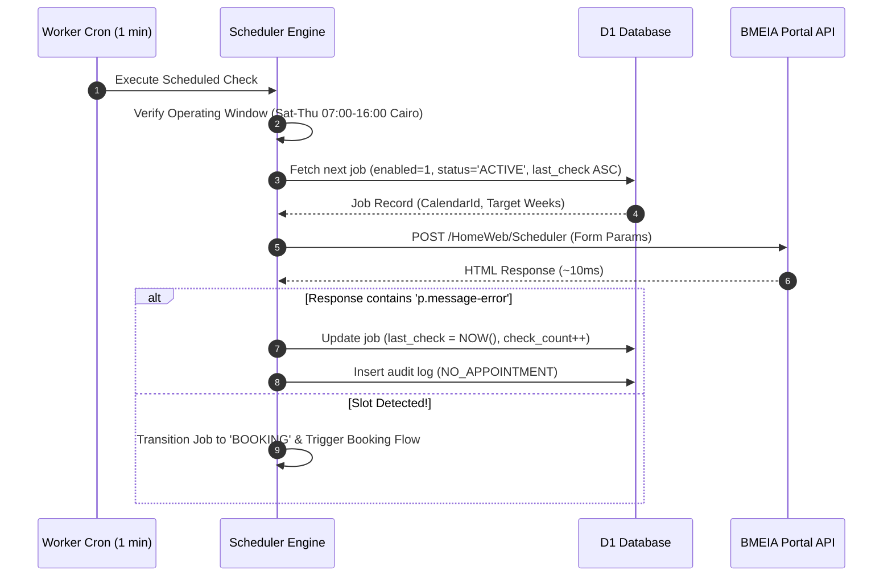
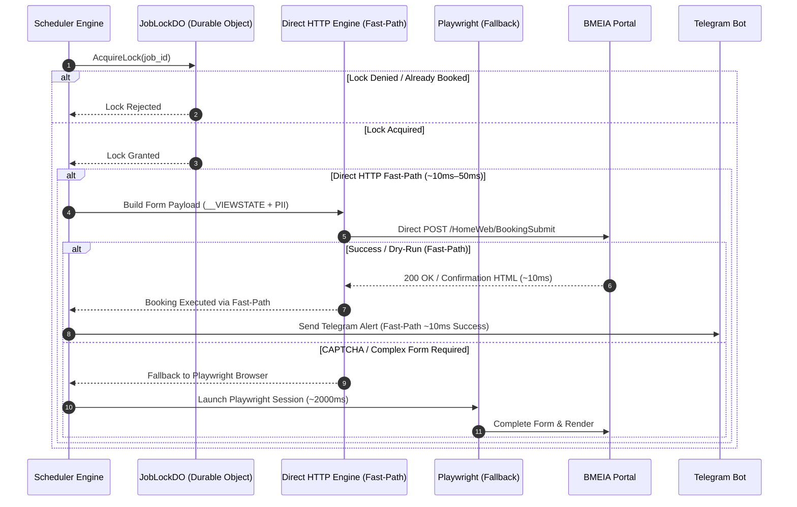

# Technical Architecture Specification — BMEIA Appointment Automation (opran-booking)

> **Status:** FINAL  
> **Target Environment:** Cloudflare Workers Platform (Free Tier Compatible)  
> **Core Framework:** TypeScript, `@cloudflare/playwright`, Cloudflare D1, Cloudflare Durable Objects  

---

## 1. System Topology Architecture


---

## 2. Architectural Invariants (AD-1 to AD-7)

| ID | Title | Rule & Binding | Prevents |
|---|---|---|---|
| **AD-1** | Storage Tier Classification | D1 = Relational source of truth & audit logs.<br>Durable Objects = Atomic job locks & state mutation.<br>KV = Temporary session cookies (`storageState`). | Data corruption & split-brain locks |
| **AD-2** | Consolidated Worker Topology | Single Cloudflare Worker combining HTTP handlers, Cron triggers, and Browser bindings. Service bindings deferred until needed. | Premature microservice abstraction bloat |
| **AD-3** | Application-Level PII Encryption | All PII fields (`passport_number`, `phone`, `email`, `first_name`, `last_name`) encrypted using AES-256-GCM before writing to D1. Key in Worker Secret `PII_ENCRYPTION_KEY`. | Unencrypted PII leaks in database backups |
| **AD-4** | Single-POST Availability Scanner | Availability checks bypass UI steps, executing `POST /HomeWeb/Scheduler` directly with form params. | Excessive browser time budget consumption |
| **AD-5** | Atomic Job Lock Actor | Every client job binds to a dedicated Durable Object (`JobLockDO`). Booking attempts require DO lock acquisition before browser launch. | Double-booking race conditions |
| **AD-6** | Mandatory Dry-Run Safety | `DRY_RUN=true` environment flag stops Playwright execution prior to final form `Submit`. Requires operator verification to lift. | Accidental live bookings during testing |
| **AD-7** | Outstanding Workload Scheduler | Queue prioritization orders active jobs strictly by `last_check ASC` (oldest outstanding check first). | Unfair starvation of older client jobs |
| **AD-8** | Edge Origin Proximity Placement | Worker `placement = { mode = "smart" }` configured in `wrangler.toml` to colocate execution near BMEIA origin (Vienna/Frankfurt). | High cross-continental network latency RTT |
| **AD-9** | Pre-Serialized Zero-Allocation Payloads | Client form payloads pre-serialized into memory buffers before slot detection. | Runtime string building & allocation latency |
| **AD-10** | Concurrent Multi-Candidate Parallel Fan-Out | Concurrent slot submission executes via `Promise.all()` across pre-warmed HTTP persistent connections for all candidates simultaneously. | Sequential candidate submission delays |

---

## 3. Database Schema (Cloudflare D1)

```sql
-- Client Candidate Table
CREATE TABLE IF NOT EXISTS clients (
    id TEXT PRIMARY KEY,
    first_name_enc TEXT NOT NULL,
    last_name_enc TEXT NOT NULL,
    gender TEXT CHECK (gender IN ('Male', 'Female')),
    dob TEXT NOT NULL,
    nationality TEXT NOT NULL,
    passport_number_enc TEXT NOT NULL,
    passport_expiry TEXT NOT NULL,
    email_enc TEXT NOT NULL,
    phone_enc TEXT NOT NULL,
    category TEXT CHECK (category IN ('Bachelor', 'Master_PhD')) NOT NULL,
    calendar_id INTEGER NOT NULL,
    status TEXT CHECK (status IN ('DRAFT', 'VALIDATION_ERROR', 'READY')) DEFAULT 'DRAFT',
    created_at TIMESTAMP DEFAULT CURRENT_TIMESTAMP,
    updated_at TIMESTAMP DEFAULT CURRENT_TIMESTAMP
);

-- Client Job Lifecycle Table
CREATE TABLE IF NOT EXISTS jobs (
    id TEXT PRIMARY KEY,
    client_id TEXT NOT NULL REFERENCES clients(id) ON DELETE CASCADE,
    enabled INTEGER DEFAULT 0, -- 0 = Paused, 1 = Enabled
    status TEXT CHECK (status IN (
        'DRAFT', 'VALIDATION_ERROR', 'READY', 'ACTIVE', 
        'SEARCHING', 'BOOKING', 'BOOKED', 'BOOKING_FAILED', 
        'TEMPORARY_ERROR', 'PORTAL_ERROR', 'CANCELLED', 'EXPIRED'
    )) DEFAULT 'DRAFT',
    start_date TEXT NOT NULL,
    end_date TEXT NOT NULL,
    allowed_days TEXT NOT NULL, -- JSON Array: ["Monday", "Wednesday"]
    preferred_time_start TEXT DEFAULT '08:00',
    preferred_time_end TEXT DEFAULT '16:00',
    check_count INTEGER DEFAULT 0,
    last_check TIMESTAMP,
    last_error_code TEXT,
    backoff_until TIMESTAMP,
    created_at TIMESTAMP DEFAULT CURRENT_TIMESTAMP,
    updated_at TIMESTAMP DEFAULT CURRENT_TIMESTAMP
);

-- Audit Logs Table
CREATE TABLE IF NOT EXISTS audit_logs (
    id INTEGER PRIMARY KEY AUTOINCREMENT,
    job_id TEXT REFERENCES jobs(id),
    client_id TEXT REFERENCES clients(id),
    event_type TEXT NOT NULL,
    duration_ms INTEGER,
    error_code TEXT,
    details TEXT,
    created_at TIMESTAMP DEFAULT CURRENT_TIMESTAMP
);

-- Daily Execution Metrics Table
CREATE TABLE IF NOT EXISTS daily_metrics (
    date TEXT PRIMARY KEY, -- YYYY-MM-DD
    total_checks INTEGER DEFAULT 0,
    total_browser_seconds REAL DEFAULT 0.0,
    slots_found INTEGER DEFAULT 0,
    bookings_completed INTEGER DEFAULT 0,
    budget_alert_sent INTEGER DEFAULT 0
);

-- Indexes for Scheduler Performance
CREATE INDEX IF NOT EXISTS idx_jobs_scheduler ON jobs(enabled, status, backoff_until, last_check);
CREATE INDEX IF NOT EXISTS idx_audit_job ON audit_logs(job_id, created_at);
```

---

## 4. Execution Sequence Diagrams

### 4.1 Scheduled Availability Check (Scanner Flow)



### 4.2 Dual Booking Execution Flow (Fast-Path HTTP ~10ms vs Playwright Fallback)


            PW->>BMEIA: Click Submit Button
            BMEIA-->>PW: Confirmation Page & Ref ID
            PW->>DO: Set Permanent State 'BOOKED'
            Sched->>TG: Send Telegram Alert (BOOKED Success!)
        end
    end
```

---

## 5. Security Architecture & Encryption Details

### AES-256-GCM Encryption Helper Specification
- **Algorithm**: `AES-GCM` with 256-bit key length.
- **Initialization Vector (IV)**: 12-byte cryptographically secure random IV generated per encryption operation.
- **Storage Format**: Ciphertext formatted as `base64(IV + Ciphertext + Tag)`.
- **Key Source**: Loaded from `env.PII_ENCRYPTION_KEY` at runtime using Web Crypto API (`crypto.subtle`).

---

## 6. Error & Failure Modes Matrix

| Failure Mode | Detection Indicator | System Reaction | Recovery Action |
|---|---|---|---|
| Portal Down / 5xx | HTTP 500 / 503 or Connection Timeout | Transition to `TEMPORARY_ERROR` | Exponential Backoff (2, 4, 8... mins) |
| Layout Shift / Unexpected DOM | Missing expected HTML elements | Transition to `PORTAL_ERROR` | Log DOM snippet + Alert Operator |
| Slot Disappeared Mid-Booking | "Slot no longer available" text | Transition to `BOOKING_FAILED` | Re-queue job to `ACTIVE` |
| Daily Browser Budget Reached (90%) | Cumulative browser time ≥ 540s | Trip safety circuit breaker | Halt new browser launches + Telegram Alert |
| Concurrent Worker Execution | DO Lock collision | First wins, second aborts immediately | Silent abort, zero duplicate submission |
