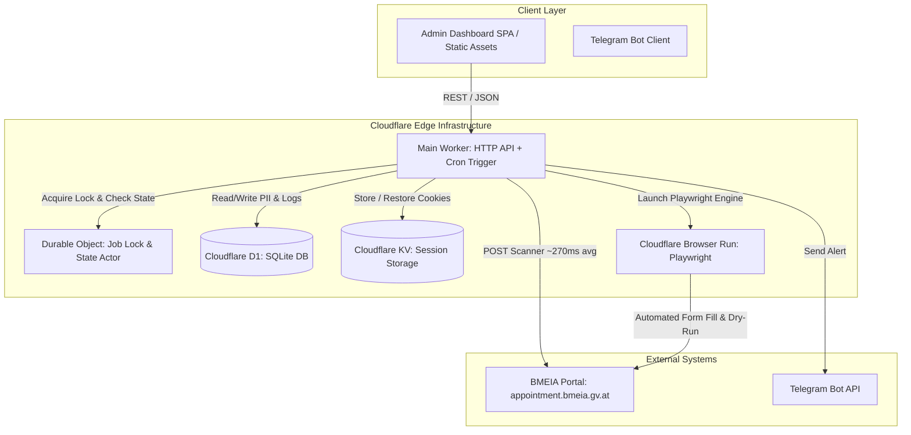

# 1. System Topology Architecture

```mermaid
flowchart TD
    subgraph Client Layer
        AdminUI[Admin Dashboard SPA / Static Assets]
        TGClient[Telegram Bot Client]
    end

    subgraph Cloudflare Edge Infrastructure
        Worker[Main Worker: HTTP API + Cron Trigger]
        DO[Durable Object: Job Lock & State Actor]
        D1[(Cloudflare D1: SQLite DB)]
        KV[(Cloudflare KV: Session Storage)]
        BrowserRun[Cloudflare Browser Run: Playwright]
    end

    subgraph External Systems
        BMEIA[BMEIA Portal: appointment.bmeia.gv.at]
        TelegramAPI[Telegram Bot API]
    end

    AdminUI -->|REST / JSON| Worker
    Worker -->|Read/Write PII & Logs| D1
    Worker -->|Acquire Lock & Check State| DO
    Worker -->|Store / Restore Cookies| KV
    Worker -->|POST Scanner ~270ms avg| BMEIA
    Worker -->|Launch Playwright Engine| BrowserRun
    BrowserRun -->|Automated Form Fill & Dry-Run| BMEIA
    Worker -->|Send Alert| TelegramAPI
```

---
