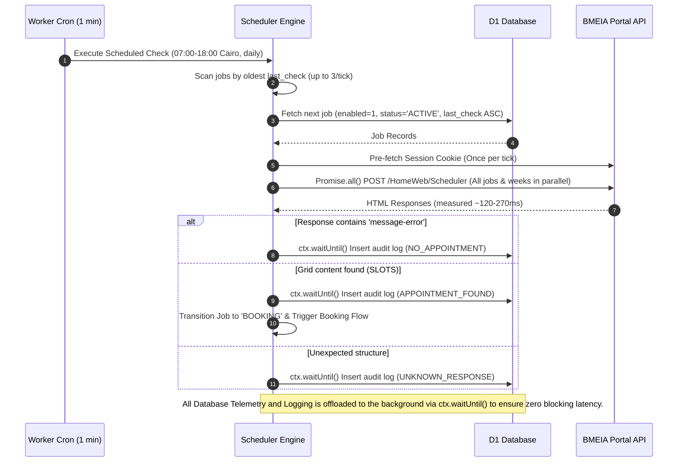
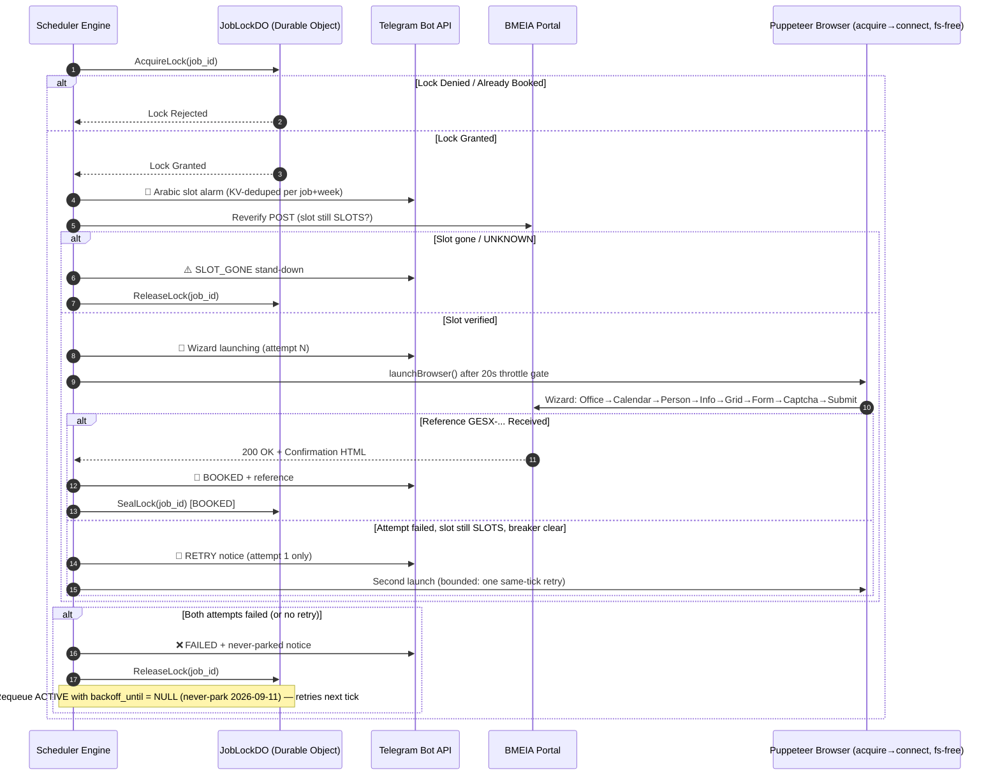

# 4. Execution Sequence Diagrams

## 4.1 Scheduled Availability Check (Scanner Flow)

## 4.2 Booking Flow (Direct HTTP Mode & Playwright Fallback)

> Single-engine architecture since 2026-09-11: direct HTTP submission is retired (FR-7) and the wizard launches exclusively via `@cloudflare/puppeteer` (`launchBrowser`), after Playwright's `fs.mkdtemp` crash made every launch fail. Billed browser seconds exclude the 20s throttle-gate wait (`workStartTime`). Operator applies manually in parallel off the Arabic slot alarm.

---
