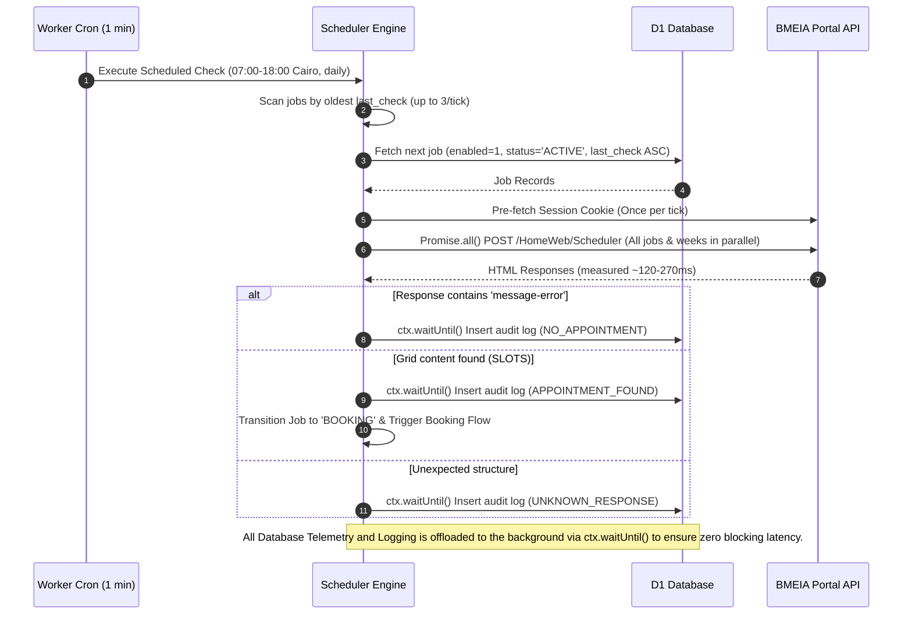
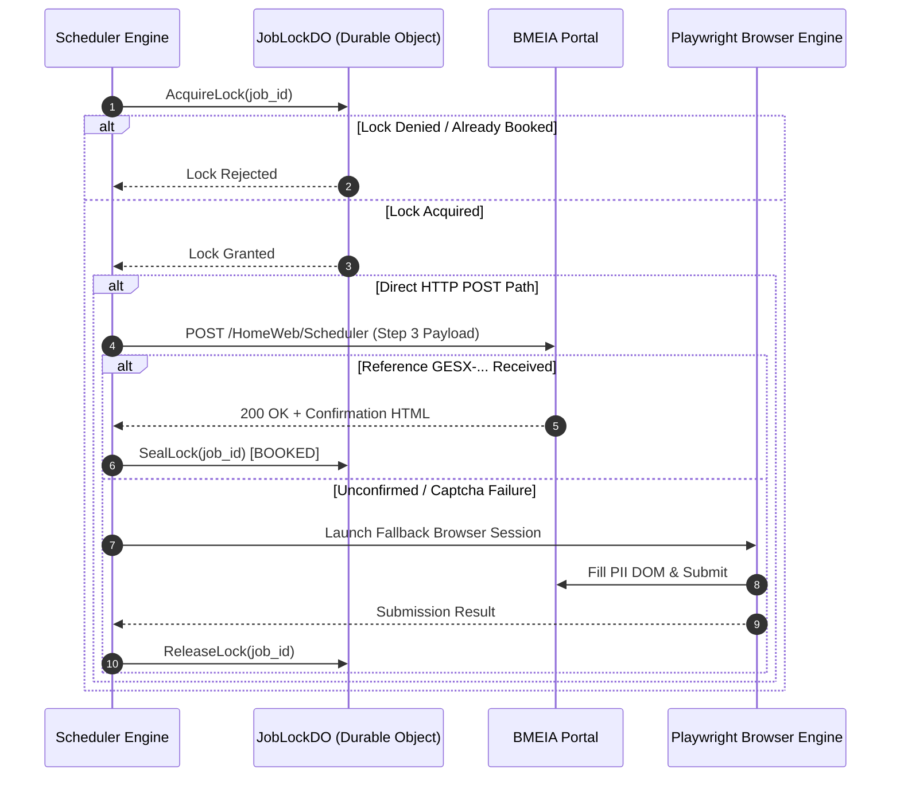

# 4. Execution Sequence Diagrams

## 4.1 Scheduled Availability Check (Scanner Flow)

## 4.2 Booking Flow (Direct HTTP Mode & Playwright Fallback)

> The dual-engine architecture prioritizes ultra-low latency direct HTTP POST execution (~200ms), falling back automatically to Cloudflare Playwright browser automation if HTTP direct submission requires browser interaction.

---
