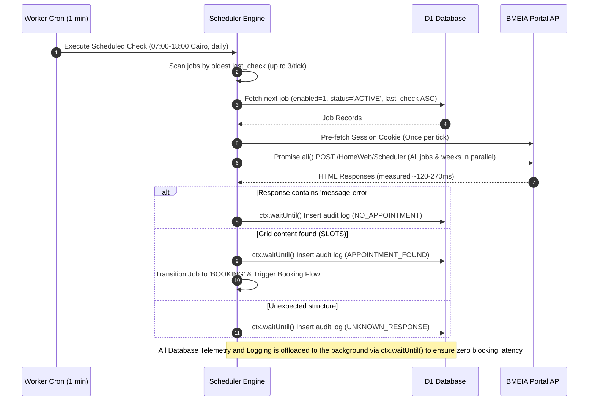
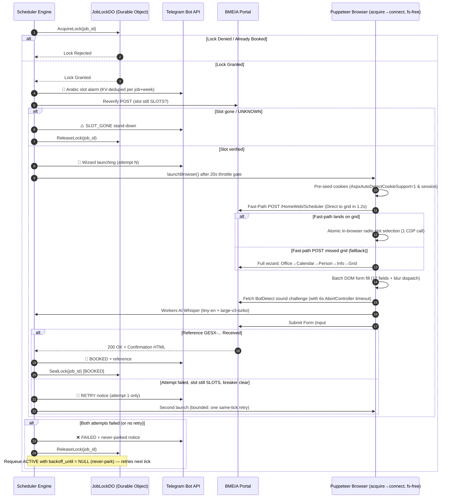

# 4. Execution Sequence Diagrams

## 4.1 Scheduled Availability Check (Scanner Flow)

```mermaid
sequenceDiagram
    autonumber
    participant Cron as Worker Cron (1 min)
    participant Sched as Scheduler Engine
    participant D1 as D1 Database
    participant BMEIA as BMEIA Portal API

    Cron->>Sched: Execute Scheduled Check (07:00-18:00 Cairo, daily)
    Sched->>Sched: Scan jobs by oldest last_check (up to 3/tick)
    Sched->>D1: Fetch next job (enabled=1, status='ACTIVE', last_check ASC)
    D1-->>Sched: Job Records
    Sched->>BMEIA: Pre-fetch Session Cookie (Once per tick)
    Sched->>BMEIA: Promise.all() POST /HomeWeb/Scheduler (All jobs & weeks in parallel)
    BMEIA-->>Sched: HTML Responses (measured ~120-270ms)
    alt Response contains 'message-error'
        Sched->>D1: ctx.waitUntil() Insert audit log (NO_APPOINTMENT)
    else Grid content found (SLOTS)
        Sched->>D1: ctx.waitUntil() Insert audit log (APPOINTMENT_FOUND)
        Sched->>Sched: Transition Job to 'BOOKING' & Trigger Booking Flow
    else Unexpected structure
        Sched->>D1: ctx.waitUntil() Insert audit log (UNKNOWN_RESPONSE)
    end
    Note over Sched,D1: All Database Telemetry and Logging is offloaded to the background via ctx.waitUntil() to ensure zero blocking latency.
```

## 4.2 Booking Flow (Puppeteer Fast-Path Wizard)

```mermaid
sequenceDiagram
    autonumber
    participant Sched as Scheduler Engine
    participant DO as JobLockDO (Durable Object)
    participant TG as Telegram Bot API
    participant BMEIA as BMEIA Portal
    participant BW as Puppeteer Browser (acquire→connect, fs-free)

    Sched->>DO: AcquireLock(job_id)
    alt Lock Denied / Already Booked
        DO-->>Sched: Lock Rejected
    else Lock Granted
        DO-->>Sched: Lock Granted
        Sched->>TG: 🚨 Arabic slot alarm (KV-deduped per job+week)
        Sched->>BMEIA: Reverify POST (slot still SLOTS?)
        alt Slot gone / UNKNOWN
            Sched->>TG: ⚠️ SLOT_GONE stand-down
            Sched->>DO: ReleaseLock(job_id)
        else Slot verified
            Sched->>TG: 🤖 Wizard launching (attempt N)
            Sched->>BW: launchBrowser() after 20s throttle gate
            BW->>BW: Pre-seed cookies (AspxAutoDetectCookieSupport=1 & session)
            BW->>BMEIA: Fast-Path POST /HomeWeb/Scheduler (Direct to grid in 1.2s)
            alt Fast-path lands on grid
                BW->>BW: Atomic in-browser radio slot selection (1 CDP call)
            else Fast-path POST missed grid (fallback)
                BW->>BMEIA: Full wizard: Office→Calendar→Person→Info→Grid
            end
            BW->>BW: Batch DOM form fill (17 fields + blur dispatch)
            BW->>BMEIA: Fetch BotDetect sound challenge (with 6s AbortController timeout)
            BW->>Sched: Workers AI Whisper (tiny-en + large-v3-turbo)
            BW->>BMEIA: Submit Form (input#nextButton)
            alt Reference GESX-... Received
                BMEIA-->>Sched: 200 OK + Confirmation HTML
                Sched->>TG: 🎉 BOOKED + reference
                Sched->>DO: SealLock(job_id) [BOOKED]
            else Attempt failed, slot still SLOTS, breaker clear
                Sched->>TG: 🔁 RETRY notice (attempt 1 only)
                Sched->>BW: Second launch (bounded: one same-tick retry)
            end
        end
        alt Both attempts failed (or no retry)
            Sched->>TG: ❌ FAILED + never-parked notice
            Sched->>DO: ReleaseLock(job_id)
            Note over Sched,DO: Requeue ACTIVE with backoff_until = NULL (never-park) — retries next tick
        end
    end
```

> Single-engine architecture (revised 2026-09-24): direct HTTP submission is retired (FR-7) and the wizard launches exclusively via `@cloudflare/puppeteer` (`launchBrowser`). Browser sessions pre-seed `AspxAutoDetectCookieSupport=1` to eliminate ASP.NET 302 redirects, execute direct POST to `/HomeWeb/Scheduler` to reach the week grid in ~1.2s, select slot radios atomically via in-browser DOM evaluation, fill personal data in batch with `blur` events, and solve audio CAPTCHAs via Cloudflare Workers AI Whisper with timeout safeguards. Billed browser seconds exclude the 20s throttle-gate wait (`workStartTime`), keeping total browser time under 4–6s per attempt.

---
