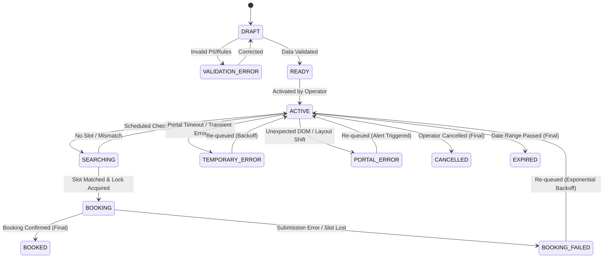

# Product Requirements Document (PRD) — BMEIA Appointment Automation Platform (opran-booking)

> **Status:** FINAL (MVP Specification)  
> **Version:** 1.0.0  
> **Last Updated:** 2026-08-19  
> **Author:** Principal Staff Engineer & Product Manager  

---

## 1. Executive Summary & Product Vision

**opran-booking** is a specialized SaaS automation platform designed to automate appointment bookings for Austrian Student Visas (Aufenthaltsbewilligung Student) at the Austrian Embassy in Cairo via the official Austrian Ministry of Foreign Affairs (BMEIA) portal (`appointment.bmeia.gv.at`).

The platform allows a single operator to input candidate client details once. During designated operating hours, the system autonomously checks appointment availability, matches available slots against candidate preference rules, and executes bookings with sub-second response times upon slot release.

---

## 2. Locked Strategic Decisions (D1–D6)

| ID | Decision | Locked Value | Rationale |
|---|---|---|---|
| **D1** | Automation Scope | Autonomous booking up to final `Submit` (with mandatory initial Dry-Run mode) | Operator requirement for competitive speed |
| **D2** | MVP Scale | Up to 10 active concurrent client jobs | Micro-operator scale fitting Cloudflare Free Tier |
| **D3** | Cost Policy | $0 cost target on Cloudflare Free Tier ($5 Paid Workers fallback if needed) | Zero-cost initial deployment mandate |
| **D4** | Notifications | Telegram Bot API for Operator alerts exclusively | Streamlined single-channel operational alerts |
| **D5** | Operating Window | Saturday to Thursday, 07:00–16:00 Cairo Time (UTC handled in worker logic) | Embassy working hours & slot release windows |
| **D6** | User Architecture | Single Operator admin account | Simplified MVP scope without multi-tenancy |

---

## 3. User Persona & Scope Boundaries

### 3.1 Primary User: System Operator
- Controls client job lifecycles (Create, Edit, Validate, Activate, Pause, Cancel).
- Configures global system settings and Dry-Run safety flags.
- Receives Telegram notifications for successful bookings and critical errors.
- Views real-time audit logs and success metrics.

### 3.2 Candidate Client (Data Subject)
- Passive entity represented in the system.
- No direct user account, dashboard access, or direct system notifications in MVP.

---

## 4. Unified State Machine

Every client appointment job follows a strict single-state lifecycle. Dual status flags are strictly prohibited to prevent race conditions.

### State Matrix Definitions

| State | Description | Allowed Transitions | Trigger |
|---|---|---|---|
| `DRAFT` | Incomplete client records or unvalidated rules | `READY`, `VALIDATION_ERROR`, `CANCELLED` | Operator input |
| `VALIDATION_ERROR` | Failed schema/formatting check | `DRAFT` | Validation engine |
| `READY` | Complete and validated, awaiting activation | `ACTIVE`, `CANCELLED` | Operator action |
| `ACTIVE` | Enabled and eligible for scheduling | `SEARCHING`, `CANCELLED` | Scheduler / Operator toggle |
| `SEARCHING` | Availability check actively running | `ACTIVE`, `BOOKING` | Cron Worker |
| `BOOKING` | Slot matched; Durable Object lock active | `BOOKED`, `BOOKING_FAILED` | Playwright Engine |
| `BOOKED` | **Terminal**: Appointment confirmed | None | Final receipt capture |
| `BOOKING_FAILED` | Slot disappeared or submission rejected | `ACTIVE`, `CANCELLED` | Playwright Engine |
| `TEMPORARY_ERROR` | Network timeout or HTTP 5xx | `ACTIVE` | Error handler (Backoff) |
| `PORTAL_ERROR` | Unknown portal structural change | `ACTIVE` | Error handler (Backoff + Alert) |
| `CANCELLED` | **Terminal**: Manually stopped | None | Operator action |
| `EXPIRED` | **Terminal**: Latest allowed date passed | None | Scheduler audit |

---

## 5. Functional Requirements (FR)

### FR-1: Client Management & PII Schema
- System shall store complete client profile: First Name, Last Name, Gender, Date of Birth, Nationality, Passport Number, Passport Expiry, Email, Phone Number, Category (Bachelor vs. Master/PhD).
- All client PII fields shall be encrypted using AES-256-GCM before writing to Cloudflare D1.

### FR-2: Structural Validation Engine
- System shall validate client data against BMEIA requirements prior to allowing transition to `READY`.
- Passport expiration must be valid for at least 6 months beyond the target appointment window.
- Invalid data transitions the record to `VALIDATION_ERROR` with explicit error details displayed in UI.

### FR-3: Appointment Preference Rules
- Operator shall define specific rules per client:
  - `calendar_id`: `44281520` (Bachelor) or `44279679` (Master/PhD/Scholarship).
  - `start_date`: Earliest acceptable date (`YYYY-MM-DD`).
  - `end_date`: Latest acceptable date (`YYYY-MM-DD`).
  - `preferred_days`: Allowed days of week (e.g., Monday, Wednesday).
  - `preferred_time_range`: Allowed time range (e.g., 08:00–12:00).

### FR-4: Fair Scheduler Engine
- Scheduler shall run via Cloudflare Worker Cron Trigger every 1 minute.
- Operating Window Check: Executes only between Saturday 07:00 and Thursday 16:00 Cairo Time (UTC converted).
- Fairness Algorithm: Selects `ACTIVE` jobs ordered strictly by **oldest `last_check` timestamp** (measuring outstanding backlog, NOT daily attempt counts).
- Backoff Policy: Jobs with `TEMPORARY_ERROR` or `BOOKING_FAILED` apply exponential backoff (2, 4, 8, 16, 32, max 60 minutes).

### FR-5: Single POST Discovery Scanner
- Discovery scanner shall execute availability checks via direct HTTP `POST` to `https://appointment.bmeia.gv.at/HomeWeb/Scheduler`.
- Payload parameters: `Language=en`, `Office=KAIRO`, `CalendarId=<ID>`, `PersonCount=1`, `Monday=<Week_Monday_Timestamp>`, `Command=Next`.
- Response contract: Presence of `p.message-error` indicates no appointments. Absence indicates open slots (~10ms latency).

### FR-6: Distributed Locking & Double-Booking Prevention
- Each client job shall be bound to a dedicated Cloudflare Durable Object instance acting as an atomic state lock.
- Before executing a booking attempt (`BOOKING` state), the Worker must acquire the DO lock.
- Once a job reaches `BOOKED` state, the DO lock permanently seals the job, preventing any further checks or duplicate bookings.

### FR-7: Dual Booking Engine (Direct HTTP Fast-Path Primary + Playwright Fallback)
- **Direct HTTP Fast-Path (Primary)**: System executes direct HTTP `POST` form submissions directly from Cloudflare Worker `fetch()`, achieving sub-50ms (~10ms–50ms) execution speed without browser overhead.
- **Playwright Browser Fallback (Secondary)**: Utilizes `@cloudflare/playwright` on Cloudflare Browser Run if CAPTCHA or DOM layout shift is encountered.
- **Dry-Run Safety**: Enforced globally via environment config `DRY_RUN=true`. Direct HTTP and Playwright engines evaluate payload parameters and halt prior to final `Submit` until payload parameters are verified against live slots.

### FR-8: Audit Logging & Metrics
- All events (`CHECK_STARTED`, `NO_APPOINTMENT`, `SLOT_MATCHED`, `BOOKING_STARTED`, `DRY_RUN_STOPPED`, `BOOKED`, `ERROR`) shall be logged to D1 table `audit_logs`.
- Logs shall include `job_id`, `client_id`, `event_type`, `duration_ms`, `error_code`, and ISO timestamp.

### FR-9: Operator Telegram Alerts
- System shall send immediate Telegram alerts via Bot API for:
  - `BOOKED`: Client name, appointment date/time, reference ID, screenshot link.
  - `CRITICAL`: Daily browser budget reaching 90%, repeated portal errors, consecutive check failures (>5).

### FR-10: Operator Admin Dashboard
- Single-page web application hosted on Cloudflare Workers Static Assets.
- Functions: Client listing, status filtering, client creation/editing, job activation/pausing, audit log viewer, live metrics (checks/hr, slot hit rate).

---

## 6. Non-Functional Requirements (NFR)

### NFR-1: Security & Compliance
- **Zero Hardcoded Secrets**: Secrets (Telegram Token, Encryption Key) stored exclusively in Cloudflare Worker Secrets.
- **Log Masking**: Passport numbers and sensitive phone numbers masked (`XXXXXX1234`) in all application logs.
- **Data Retention**: Client PII automatically purged from D1 30 days post terminal state (`BOOKED`, `CANCELLED`, `EXPIRED`).

### NFR-2: Cloudflare Free Tier Resource Budgeting
- Max Browser Time: 600 seconds/day. System monitors cumulative daily execution time and auto-trips at 90% (540s) with operator alert.
- Browser Concurrency: Maximum 3 concurrent Playwright browser sessions.
- Launch Throttle: Minimum 20 seconds between browser launches.

### NFR-3: Performance & Latency
- Availability check latency: < 500ms per request.
- Booking execution (Slot detection → Submission): < 3.0 seconds total browser execution time.

---

## 7. Verification & Acceptance Criteria

1. **Unit Tests**: Rule-matching logic tested with pure functions (date/time/calendar filtering).
2. **Integration Tests**: Scheduler queue sorting verified to prioritize oldest `last_check` over count.
3. **Concurrency Test**: Simultaneous trigger of 2 workers on same client job resolves cleanly with exactly 1 DO lock acquisition and zero double bookings.
4. **Dry-Run Test**: End-to-end execution on live/mock portal stops before final submit and stores verification screenshot.
