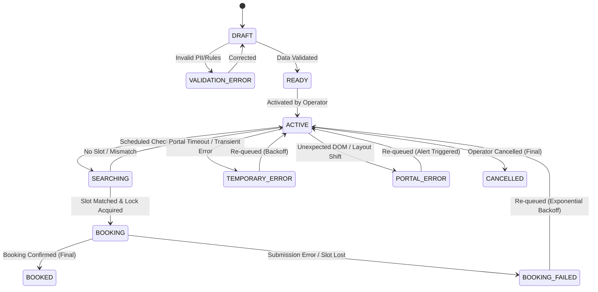

# Product Requirements Document (PRD) — BMEIA Appointment Automation Platform (opran-booking)

> **Status:** FINAL (MVP Specification)  
> **Version:** 1.1.0  
> **Last Updated:** 2026-08-20  
> **Author:** Principal Staff Engineer & Product Manager  

---

## 1. Executive Summary & Product Vision

**opran-booking** is a specialized SaaS automation platform designed to automate appointment bookings for Austrian Student Visas (Aufenthaltsbewilligung Student) at the Austrian Embassy in Cairo via the official Austrian Ministry of Foreign Affairs (BMEIA) portal (`appointment.bmeia.gv.at`).

The platform allows a single operator to input candidate client details once. During designated operating hours, the system autonomously checks appointment availability, matches available slots against candidate preference rules, and executes bookings with sub-second response times upon slot release.

---

## 2. Locked Strategic Decisions (D1–D8)

| ID | Decision | Locked Value | Rationale |
|---|---|---|---|
| **D1** | Automation Scope | Autonomous booking up to final `Submit` (with mandatory initial Dry-Run mode) | Operator requirement for competitive speed |
| **D2** | MVP Scale | Up to 10 active concurrent client jobs | Micro-operator scale fitting Cloudflare Free Tier |
| **D3** | Cost Policy | $0 cost target on Cloudflare Free Tier ($5 Paid Workers fallback if needed) | Zero-cost initial deployment mandate |
| **D4** | Notifications | Telegram Bot API for Operator alerts exclusively | Streamlined single-channel operational alerts |
| **D5** | Scanning Schedule | Global Cairo operating window **07:00–18:00, every day (Friday included)**; scanning runs every minute inside the window only | Operator decision 2026-08-20 — **amends the 2026-08-19 lock (24/7, no window)**; same underlying rationale: no fixed release schedule exists on the portal |
| **D6** | User Architecture | Single Operator admin account | Simplified MVP scope without multi-tenancy |
| **D7** | Operator Authorization | "أنا أصرّح بأتمتة عملية حجز المواعيد عبر منصة BMEIA باستخدام النظام." — records the operator's explicit authorization to automate the BMEIA appointment booking process using this system | Operator statement 2026-08-19; documents operator authorization only — not BMEIA approval, not a legal conclusion |
| **D8** | Request Lifetime | A request stays `ACTIVE` **forever** until `BOOKED` or operator/client cancellation — no date-based expiry | Operator decision 2026-08-20; the `EXPIRED` state is retained only for schema compatibility — no code path sets it |

---

## 3. User Persona & Scope Boundaries

### 3.1 Primary User: System Operator
- Controls client job lifecycles (Create, Edit, Validate, Activate, Pause, Cancel).
- Configures global system settings and Dry-Run safety flags.
- Receives Telegram notifications for successful bookings and critical errors.
- Views real-time audit logs and success metrics.

### 3.2 Candidate Client (Data Subject)
- Passive entity represented in the system.
- No direct user account, dashboard access, or direct system notifications in MVP.

---

## 4. Unified State Machine

Every client appointment job follows a strict single-state lifecycle. Dual status flags are strictly prohibited to prevent race conditions.

> **2026-08-20 amendment (D8):** the `ACTIVE --> EXPIRED` transition ("Date Range Passed") was removed — requests have no end date. `EXPIRED` stays in the state enum for D1 schema compatibility only.

### State Matrix Definitions

| State | Description | Allowed Transitions | Trigger |
|---|---|---|---|
| `DRAFT` | Incomplete client records or unvalidated rules | `READY`, `VALIDATION_ERROR`, `CANCELLED` | Operator input |
| `VALIDATION_ERROR` | Failed schema/formatting check | `DRAFT` | Validation engine |
| `READY` | Complete and validated, awaiting activation | `ACTIVE`, `CANCELLED` | Operator action |
| `ACTIVE` | Enabled and eligible for scheduling | `SEARCHING`, `CANCELLED` | Scheduler / Operator toggle |
| `SEARCHING` | Availability check actively running | `ACTIVE`, `BOOKING` | Cron Worker |
| `BOOKING` | Slot matched; Durable Object lock active | `BOOKED`, `BOOKING_FAILED` | Playwright Engine |
| `BOOKED` | **Terminal**: Appointment confirmed | None | Final receipt capture |
| `BOOKING_FAILED` | Slot disappeared or submission rejected | `ACTIVE`, `CANCELLED` | Playwright Engine |
| `TEMPORARY_ERROR` | Network timeout or HTTP 5xx | `ACTIVE` | Error handler (Backoff) |
| `PORTAL_ERROR` | Unknown portal structural change | `ACTIVE` | Error handler (Backoff + Alert) |
| `CANCELLED` | **Terminal**: Manually stopped | None | Operator action |
| `EXPIRED` | **Legacy** — was "Latest allowed date passed"; no code path sets it since D8 (no date ranges) | None | Retained for D1 schema compatibility |

---

## 5. Functional Requirements (FR)

### FR-1: Client Management & PII Schema
- System shall store complete client profile: First Name, Last Name, Family Name at Birth, Gender, Date of Birth, Place of Birth, Country of Birth, Nationality, Nationality at Birth, Passport Number, Passport Issue Date, Passport Issuing Country, Passport Expiry, Street & House Number, Postal Code, City, Email, Phone Number, Category (Bachelor vs. Master/PhD).
- All client PII fields shall be encrypted using AES-256-GCM before writing to Cloudflare D1. Encryption classes follow the 2026-08-20 convention: identity/contact strings (names, passport number, address street/city/postal code, email, phone) encrypted; dates and categorical values (DoB, passport dates, nationalities, place/country of birth) plaintext — same class as the pre-existing `dob`/`nationality` columns.

### FR-2: Structural Validation Engine
- System shall validate client data against BMEIA requirements prior to allowing transition to `READY`.
- `[ASSUMPTION — to confirm against the official requirements list]` Passport expiration must be valid for at least 6 months beyond the target appointment window.
- Invalid data transitions the record to `VALIDATION_ERROR` with explicit error details displayed in UI.

### FR-3: Appointment Preference Rules
- Preference rules are **global and identical for every client** (operator decision 2026-08-20 — no per-client customization):
  - Operating window: every day, 07:00–18:00 Cairo time (Friday included).
  - Scan horizon: current week + 7 forward weeks (8 Mondays, global constant).
- The only per-client preference is `calendar_id`: `44281520` (Bachelor) or `44279679` (Master/PhD/Scholarship).
- No per-client date range, day selection, or time range is collected or stored.

### FR-4: Fair Scheduler Engine (Global Cairo Window)
- Scheduler shall run via Cloudflare Worker Cron Trigger every 1 minute, **only inside the global Cairo window 07:00–18:00, daily including Friday** (D5 as amended 2026-08-20); outside the window each tick exits immediately.
- Fairness Algorithm: Selects up to 3 `ACTIVE` jobs per tick ordered strictly by **oldest `last_check` timestamp** (measuring outstanding backlog, NOT daily attempt counts).
- Rolling Horizon Scan: Each job's availability scan covers the current week plus the next 7 weeks (8 Mondays, global constant in `src/scheduler.ts`) — the portal accepts any `Monday` value (G0 §5).
- Backoff Policy: Jobs with `TEMPORARY_ERROR` or `BOOKING_FAILED` apply exponential backoff (2, 4, 8, 16, 32, max 60 minutes).

### FR-5: Single POST Discovery Scanner
- Discovery scanner shall execute availability checks via direct HTTP `POST` to `https://appointment.bmeia.gv.at/HomeWeb/Scheduler` (verified contract: `docs/portal-automation-spec.md` section 5).
- Payload parameters (verified only): `Language=en`, `Office=KAIRO`, `CalendarId=<ID>`, `PersonCount=1`, `Monday=<Week_Monday>`, `Command=Next`.
- Session handling: Worker must warm cookies via a GET redirect pass (`AspxAutoDetectCookieSupport=1` + `ASP.NET_SessionId`) and persist them in KV.
- Measured latency: ~270ms average (first request ~770ms, steady state 116–216ms).
- **3-state response contract**:
  1. `p.message-error` / "no appointments available" → `NO_SLOTS`.
  2. Scheduler page without the error and a non-empty week grid → `SLOTS`.
  3. Anything else (non-200, unexpected structure) → `UNKNOWN` — **never** treated as a slot.

### FR-6: Distributed Locking & Double-Booking Prevention
- Each client job shall be bound to a dedicated Cloudflare Durable Object instance acting as an atomic state lock.
- Before executing a booking attempt (`BOOKING` state), the Worker must acquire the DO lock.
- Once a job reaches `BOOKED` state, the DO lock permanently seals the job, preventing any further checks or duplicate bookings.

### FR-7: Booking Engine (G0-gated — fail closed)
- **The portal booking path is UNVERIFIED** (`docs/portal-automation-spec.md` section 6). No booking endpoint, form fields, or selectors may be invented.
- Live booking is **disabled by code**: any live attempt returns `Booking path UNVERIFIED` and performs no network submission. No booking reference is ever fabricated.
- **Dry-Run Safety**: Enforced globally via environment config `DRY_RUN=true`. Dry-Run prepares the verified discovery payload and halts with an audit event `DRY_RUN_STOPPED`.
- **Unlock condition**: first live slot capture per `portal-automation-spec.md` section 8 (documented grid structure, form fields, CAPTCHA location, confirmation format) + written operator legal decision (section 9).

### FR-8: Audit Logging & Metrics
- All events shall be logged to D1 table `audit_logs` with the canonical event set from the brief section 17:
  `NO_APPOINTMENT, APPOINTMENT_FOUND, RULE_MISMATCH, UNKNOWN_RESPONSE, BOOKING_STARTED, DRY_RUN_STOPPED, SUBMITTED, BOOKED, BOOKING_FAILED, TEMPORARY_ERROR, PORTAL_ERROR, BUDGET_WARNING, NOTIFY_SENT`.
- Implementation-added event (2026-08-20, client deletion): `CLIENT_DELETED` — written by `DELETE /api/clients/:id` after detaching the client's scheduler audit rows (`client_id`/`job_id` → NULL; see architecture.md §3 note).
- Logs shall include `job_id`, `client_id`, `event_type`, `duration_ms`, `error_code`, and ISO timestamp.

### FR-9: Operator Telegram Alerts
- System shall send immediate Telegram alerts via Bot API for:
  - `BOOKED`: Client name, appointment date/time, reference ID, screenshot link.
  - `CRITICAL`: Daily browser budget reaching 90%, repeated portal errors, consecutive check failures (>5).

### FR-10: Operator Admin Dashboard
- Single-page web application hosted on Cloudflare Workers Static Assets.
- Functions: Client listing, status filtering, client creation/editing/**deletion**, job activation/pausing/cancellation, audit log viewer, live metrics (checks/hr, slot hit rate).

---

## 6. Non-Functional Requirements (NFR)

### NFR-1: Security & Compliance
- **Zero Hardcoded Secrets**: Secrets (Telegram Token, Encryption Key) stored exclusively in Cloudflare Worker Secrets.
- **Log Masking**: Passport numbers and sensitive phone numbers masked (`XXXXXX1234`) in all application logs.
- **Data Retention**: Client PII automatically purged from D1 30 days post terminal state (`BOOKED`, `CANCELLED`, `EXPIRED`).

### NFR-2: Cloudflare Free Tier Resource Budgeting
- Max Browser Time: 600 seconds/day. System monitors cumulative daily execution time and auto-trips at 90% (540s) with operator alert.
- Browser Concurrency: Maximum 3 concurrent Playwright browser sessions.
- Launch Throttle: Minimum 20 seconds between browser launches.

### NFR-3: Performance & Latency
- Availability check latency: measured ~270ms average (first request ~770ms, steady state 116–216ms) — budget allows `< 500ms` per request.
- Booking execution latency: **not measured** — the booking path is unverified; targets will be set after first slot capture (G0 section 8), not before.

---

## 7. Verification & Acceptance Criteria

1. **Unit Tests**: Rule-matching logic tested with pure functions (window, horizon, calendar filtering).
2. **Integration Tests**: Scheduler queue sorting verified to prioritize oldest `last_check` over count; global-window gating (in/out of 07:00–18:00 Cairo) and rolling-horizon generation verified against the pure source module.
3. **Concurrency Test**: Simultaneous trigger of 2 workers on same client job resolves cleanly with exactly 1 DO lock acquisition and zero double bookings.
4. **Dry-Run Test**: End-to-end execution on live/mock portal stops before final submit and stores verification screenshot.
