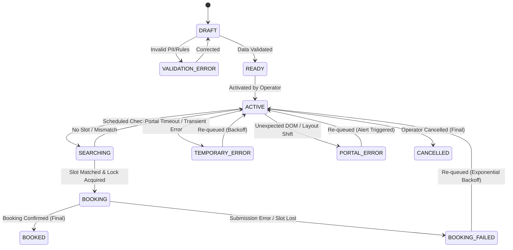

# 4. Unified State Machine

Every client appointment job follows a strict single-state lifecycle. Dual status flags are strictly prohibited to prevent race conditions.

> **2026-08-20 amendment (D8):** the `ACTIVE --> EXPIRED` transition ("Date Range Passed") was removed — requests have no end date. `EXPIRED` stays in the state enum for D1 schema compatibility only.

## State Matrix Definitions

| State | Description | Allowed Transitions | Trigger |
|---|---|---|---|
| `DRAFT` | Incomplete client records or unvalidated rules | `READY`, `VALIDATION_ERROR`, `CANCELLED` | Operator input |
| `VALIDATION_ERROR` | Failed schema/formatting check | `DRAFT` | Validation engine |
| `READY` | Complete and validated, awaiting activation | `ACTIVE`, `CANCELLED` | Operator action |
| `ACTIVE` | Enabled and eligible for scheduling | `SEARCHING`, `CANCELLED` | Scheduler / Operator toggle |
| `SEARCHING` | Availability check actively running | `ACTIVE`, `BOOKING` | Cron Worker |
| `BOOKING` | Slot matched; Durable Object lock active | `BOOKED`, `BOOKING_FAILED` | Playwright Engine |
| `BOOKED` | **Terminal**: Appointment confirmed | None | Final receipt capture |
| `BOOKING_FAILED` | Slot disappeared or submission rejected | `ACTIVE`, `CANCELLED` | Playwright Engine |
| `TEMPORARY_ERROR` | Network timeout or HTTP 5xx | `ACTIVE` | Error handler (Backoff) |
| `PORTAL_ERROR` | Unknown portal structural change | `ACTIVE` | Error handler (Backoff + Alert) |
| `CANCELLED` | **Terminal**: Manually stopped | None | Operator action |
| `EXPIRED` | **Legacy** — was "Latest allowed date passed"; no code path sets it since D8 (no date ranges) | None | Retained for D1 schema compatibility |

---
